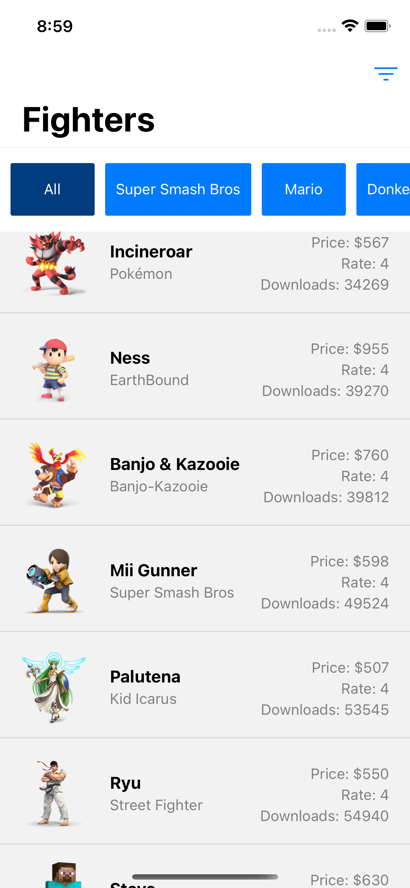

# Franklin Fighters App

React Native Crossplatform Movile App.

Technologies and Features:

* TypeScript
* React Hooks useState & useEffect
* React Native Animation
* Stack Navigation
* Custom Hooks
* Redux
* Redux Toolkit
* Middlewares
* Unit testing with Jest
* Custom Styles for Android & iOS

# Screenshots

## iOS

## Android 

